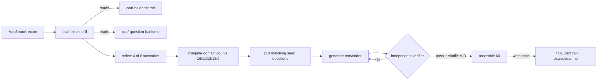
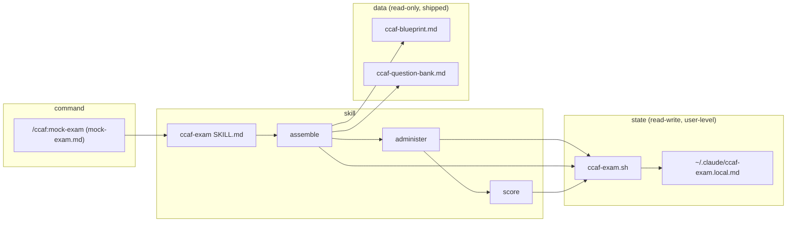

# Spec: A `/ccaf:mock-exam` mock-exam command that gates CCAF readiness at a scaled 720

> Owned by: Dinesh (dinesh@incubyte.co) · Started: 2026-06-08 · Last revised: 2026-06-08 · Spec UUID: 7e3b9a10-ccaf-4f00-9b12-bee0e1a17001
> Anthara spec — slice-decomposed, categorically-framed. Feeds /anthara:create-ticket and /anthara:develop.

---

## 1. Overview & business context

The org has mandated the **Claude Certified Architect – Foundations (CCAF)** certification for everyone, with the policy: _take a practice exam first, and only attempt the real (paid) exam once you score 720+._ Today that means each person hand-rolls a quiz from the 40-page exam guide PDF — inconsistent, unrepeatable, and easy to get wrong. This spec defines `/ccaf:mock-exam`, a new command in a standalone **`ccaf`** Claude Code plugin that administers a faithful **60-question mock exam** end-to-end in the terminal and returns a scaled `/1000` score with the **720 pass line** plus a per-domain breakdown, so anyone can self-serve the readiness gate.

The exam mirrors the real one on every replicable rule (60 questions, 4 of 6 scenarios, domain weighting 27/18/20/20/15, single-select MCQ, no penalty for guessing) and is honest about the one thing it cannot replicate: Anthropic's proprietary scaled-scoring curve. Questions are **assembled per run** from a small static seed bank (a curated set of 12 self-authored seed questions) plus model-generated questions that fill the remainder, each generated question passing an **independent verifier** before it is served. The attempt persists to a user-level file so it is **resumable**. It ships as the standalone `ccaf` plugin in the `incubyte-plugins` marketplace, so teammates install it and `/ccaf:mock-exam` appears; it runs fully offline.

This is a LOW-risk, internal, honor-system developer tool: no regulated data, no central reporting, easy to revert.

## 2. Sources

| ID  | Type                                                              | Contributor    | Date       | Description                                                                                                                                                                                                                                                                                                                                                                       |
| --- | ----------------------------------------------------------------- | -------------- | ---------- | --------------------------------------------------------------------------------------------------------------------------------------------------------------------------------------------------------------------------------------------------------------------------------------------------------------------------------------------------------------------------------- |
| 1   | CCAF Exam Guide (PDF)                                             | Anthropic, PBC | 2025-02-10 | `Claude+Certified+Architect+–+Foundations+Certification+Exam+Guide (1).pdf` — 5 domains + weightings, 6 scenarios, 12 sample questions with explanations, in/out-of-scope lists, prep exercises. Confidential NTK.                                                                                                                                                                |
| 2   | Public corroboration (certsafari / tutorialsdojo / dev.to et al.) | Web            | 2026-06-08 | Corroborates exam length (60 questions) and duration (120 min); the PDF itself states scaled 100–1000, pass = 720.                                                                                                                                                                                                                                                                |
| 3   | Codebase (`ai-plugins` repo; `ccaf` + sibling `bee`/`learn`)      | n/a            | 2026-06-08 | Claude Code plugin marketplace `incubyte-plugins`. `bee` = spec-driven TDD navigator: markdown `commands/`, `skills/*/SKILL.md`, `scripts/update-bee-state.sh` (silent state writer), `.claude/*.local.md` state (gitignored), `${CLAUDE_PLUGIN_ROOT}` paths. Sibling `learn` plugin ships `/learn:quiz` (one-at-a-time MCQ via AskUserQuestion, X/Y score, `.local.md` results). |
| 4   | Research: LLM-generated MCQ failure modes                         | Web (arXiv)    | 2026-06-08 | Documented pitfalls: answer-position/selection bias, weak or secretly-correct distractors, wrong answer keys — motivating the independent-verifier requirement.                                                                                                                                                                                                                   |
| 5   | Live brainstorm + spec session with Dinesh                        | Dinesh         | 2026-06-08 | All design decisions below (placement, hybrid sourcing, mock-only, resume, scoring formula, self-serve).                                                                                                                                                                                                                                                                          |

Fabric MCP was unreachable during the original spec session. It has since been re-checked (2026-06-10): it resolves the org-wide pack (55 rules) for this repo, but none of the rules' substantive controls apply — the tool handles no regulated data (no PHI/PCI/PII), so no pack-derived NFRs apply (see §6).

## 3. Type ontology

Categorical, non-overlapping, drawn from the exam guide [1] and the plugin conventions [3].

### 3.1 Kinds of users

- **Candidate** — a teammate taking the practice exam to decide whether they're ready for the real CCAF attempt [1, 5]. The only user role. No proctor, no admin, no reviewer.

### 3.2 Kinds of data

- **Blueprint** — the distilled, version-controlled encoding of the exam guide: the 5 domains with weights, the 6 scenarios, the in-scope/out-of-scope topic lists, and few-shot anchors. Read-only at runtime [1].
- **Seed question** — a curated, self-authored question covering a domain and scenario, with its correct answer and explanation. Version-controlled [5].
- **Generated question** — a model-authored question produced at assembly time to fill an exam to 60, grounded in the blueprint. Must pass the verifier before use [4, 5].
- **Assembled exam** — a frozen set of exactly 60 questions for one attempt: the questions, their hidden answer keys, the candidate's recorded answers, and progress metadata. Lives in the local state file; never shared [5].
- **Result** — the computed outcome of a completed exam: scaled score, pass/fail, and a per-domain breakdown. Displayed, never persisted as history [5].
- **Verifier verdict** — for a generated question, a pass/fail judgment with reason, produced by an independent evaluation that did not author the question [4].

None of this data is regulated (no PHI, PCI, PII).

### 3.3 Kinds of events

- **Exam started** — candidate runs `/ccaf:mock-exam` with no active attempt; assembly produces a new Assembled exam [5].
- **Screen answered** — candidate submits a screen of (up to 4) answers; answers and the next-question pointer are persisted [5].
- **Exam resumed** — candidate re-runs `/ccaf:mock-exam` while an in-progress attempt exists and chooses to continue [3, 5].
- **Exam scored** — the final screen is answered; the Result is computed and shown [5].

### 3.4 Kinds of states

- **No attempt** — no active exam file exists for this candidate.
- **In progress** — an Assembled exam exists with at least one unanswered question (`status: in_progress`).
- **Completed** — every question answered and scored (`status: completed`).
- **Unanswered (per question)** — a question with no recorded answer; scores as incorrect (no guessing penalty) [1].

## 4. Invariants

**4.1 Fixed length** — every Assembled exam contains exactly 60 questions. Sources: [1, 2, 5].

**4.2 Domain weighting** — the 60 questions are distributed D1=16, D2=11, D3=12, D4=12, D5=9 (27/18/20/20/15 of 60, rounded to sum exactly 60). Sources: [1, 5].

**4.3 Four scenarios** — exactly 4 of the 6 scenarios are represented in any Assembled exam, chosen at random per attempt. Sources: [1, 5].

**4.4 Single correct answer** — every question has exactly one defensible correct option among A–D; the other three are plausible-but-wrong distractors. Sources: [1, 4].

**4.5 Position carries no signal** — the correct option's letter is shuffled per question so answer position encodes nothing learnable across an exam. Sources: [4].

**4.6 Seed questions are curated and stable** — the 12 self-authored seed questions are version-controlled and are not regenerated or re-keyed at runtime. Sources: [5].

**4.7 No generated question is served unverified** — every Generated question passes the independent verifier (4.4 + 4.5 checks) before entering an Assembled exam; a failing question is regenerated or replaced, never shown. Sources: [4, 5].

**4.8 Unanswered = incorrect** — there is no penalty for guessing and no negative marking; an unanswered question contributes zero correct. Sources: [1].

**4.9 Scaled-score formula** — the scaled score uses the real exam's band: `scaled = 100 + round(correct ÷ 60 × 900)` (0 correct → 100, 60 correct → 1000); the candidate **passes iff `scaled ≥ 720`** (i.e. ≥ 42 of 60 correct). It is a transparent linear estimate over the 100–1000 band, not Anthropic's proprietary equating curve. Sources: [1, 5].

**4.10 The local attempt files are the single source of truth for an attempt** — resuming reconstructs the identical questions, order, and recorded answers from the question + answers files (a pair, cross-validated); nothing about an attempt lives only in conversation. Sources: [3, 5]. _(Revised 2026-06-10: was a single file; split into a write-once questions file and a hot answers file.)_

**4.11 Answer keys stay hidden during administration** — keys are stored in a **separate answers file** (needed for resume + scoring) that the administration phase never reads, so keys never enter the conversation; nothing key-bearing is displayed to the candidate until the Result screen. Honor-system caveat: a candidate can open the answers file; doing so only cheats themselves before a paid attempt. Sources: [5]. _(Revised 2026-06-10: keys moved out of the question file.)_

**4.12 No timer, no sharing** — the exam is untimed (no time is stamped or reported), and no result is persisted as history, exported, or reported anywhere. Sources: [5].

## 5. Slices

Outside-in, independently verifiable, sequenced for build. The single user-reachable Entry is the `/ccaf:mock-exam` command; later slices attach behaviors to it.

### 5.1 Ship the distilled blueprint and the 12-question seed bank

Establish the read-only data foundation the command reads at runtime. Distill the exam guide [1] into `ccaf/data/ccaf-blueprint.md` — the 5 domains with their weights, the 6 scenarios (name + primary domains), the in-scope and out-of-scope topic lists, and references to the 12 seed questions used as few-shot style/difficulty anchors. Author 12 self-authored questions in `ccaf/data/ccaf-question-bank.md` as the static seed bank, each carrying its correct answer, explanation, and `domain` + `scenario` + `source: authored` tags. From outside, this slice is "done" when both data files exist and a reader can confirm the 12 questions, their correct keys, and their tags are well-formed.

- **Touches types:** Blueprint, Seed question.
- **Preserves invariants:** 4.6.
- **Affected modules:** `ccaf/data/ccaf-blueprint.md` (new), `ccaf/data/ccaf-question-bank.md` (new).
- **Active packs:** none.
- **Reachability:** `root → CCAF data files (blueprint + 12-question seed bank)`.

Indicative seed-question schema (contract, not logic):

```yaml
- id: seed-04
  source: authored # authored | generated
  domain: D3 # D1..D5
  scenario: code-generation # one of the 6 scenario slugs
  stem: "You want to create a custom /review slash command ... Where should you create this command file?"
  options:
    A: "In the .claude/commands/ directory in the project repository"
    B: "In ~/.claude/commands/ in each developer's home directory"
    C: "In the CLAUDE.md file at the project root"
    D: "In a .claude/config.json file with a commands array"
  correct: A
  explanation: "Project-scoped slash commands live in .claude/commands/ ... (self-authored)"
```

Domain/scenario tags for the 12 seed questions (assembly anchors): seed-01→D1·customer-support, seed-02→D2·customer-support, seed-03→D5·customer-support, seed-04→D3·code-generation, seed-05→D3·code-generation, seed-06→D3·code-generation, seed-07→D1·multi-agent-research, seed-08→D5·multi-agent-research, seed-09→D2·multi-agent-research, seed-10→D3·claude-code-ci, seed-11→D4·claude-code-ci, seed-12→D4·claude-code-ci.

**Acceptance criteria**

- [x] **5.1.1** `ccaf/data/ccaf-blueprint.md` exists and records all 5 domains with weights 27/18/20/20/15 and the 6 scenario names with their primary domains.
- [x] **5.1.2** The blueprint records the guide's in-scope and out-of-scope topic lists, so generation can be constrained to in-scope material.
- [x] **5.1.3** `ccaf/data/ccaf-question-bank.md` contains 12 self-authored seed questions (stem, four options, single correct key, explanation), each well-formed.
- [x] **5.1.4** Each of the 12 seed questions carries a `domain` tag (D1–D5), a `scenario` tag (one of the 6 slugs), and `source: authored`, matching the mapping above.
- [x] **5.1.5** The files contain no out-of-scope topics from the guide's exclusion list (e.g. fine-tuning, billing, vision, streaming).

**Verification (slice complete when these pass):**

1. **Tests.** Run the full test suite — all green. Any structural check on the data files (well-formed schema, 12 questions present, weights sum correctly, every question has exactly one `correct` key) passes.

(Steps 2–4 omitted: no schema/migrations, no UI surface.)

### 5.2 Assemble a 60-question exam on `/ccaf:mock-exam`

Create the `/ccaf:mock-exam` command and the `ccaf-exam` skill, and implement the **assemble** phase. The command (frontmatter: `description`, `argument-hint`, scoped `allowed-tools` including the pre-approved exam-state Bash helper, `AskUserQuestion`, `Skill`) loads `ccaf/skills/ccaf-exam/SKILL.md`. On a fresh run the skill: randomly selects 4 of the 6 scenarios (4.3); computes per-domain counts to satisfy 4.2; pulls the seed questions whose scenario is in the selection as anchors; generates the remaining questions — grounded in the blueprint's in-scope material and few-shot anchors — to reach 60 while honoring the per-domain counts; runs each generated question through the **independent verifier** (a fresh evaluation, without the authoring rationale, that confirms exactly one defensible answer and three plausible-but-wrong distractors per 4.4, then shuffles A–D per 4.5); and writes the frozen Assembled exam to `~/.claude/ccaf-exam.local.md` with `status: in_progress`, empty answers, and `next_index` at the first question. From outside, "done" means running `/ccaf:mock-exam` (with no prior attempt) yields a well-formed local file of 60 questions with the correct domain distribution, the seed anchors embedded, hidden keys present, and answers empty.

- **Touches types:** Blueprint, Seed question, Generated question, Assembled exam, Verifier verdict.
- **Preserves invariants:** 4.1, 4.2, 4.3, 4.4, 4.5, 4.6, 4.7, 4.10, 4.11.
- **Affected modules:** `ccaf/commands/mock-exam.md` (new), `ccaf/skills/ccaf-exam/SKILL.md` (new), `ccaf/scripts/ccaf-exam.sh` (new, silent state writer), `ccaf/.claude-plugin/plugin.json` (new), `.claude-plugin/marketplace.json` (register `ccaf`), `ccaf/CLAUDE.md` (new), `.gitignore` (ignore the local exam file), `ccaf/data/*` (read).
- **Active packs:** none.
- **Reachability:** `CCAF data files (blueprint + 12-question seed bank) → /ccaf:mock-exam (assemble a new exam)`.

Indicative local-file schema (contract, not logic):

```markdown
---
status: in_progress # in_progress | completed
total: 60
scenarios:
  [customer-support, code-generation, multi-agent-research, claude-code-ci]
domain_counts: "D1:16,D2:11,D3:12,D4:12,D5:9"
next_index: 1 # 1-based pointer to the next unanswered question
---

## Q1 [domain=D1 scenario=customer-support source=authored id=seed-01]

<stem>
A) ...
B) ...
C) ...
D) ...
answer_key: A                # hidden during administration
user_answer:                 # blank until answered
```



**Acceptance criteria**

- [ ] **5.2.1** Running `/ccaf:mock-exam` with no existing attempt writes `~/.claude/ccaf-exam.local.md` containing exactly 60 questions (4.1).
- [ ] **5.2.2** The assembled questions match the domain distribution D1=16, D2=11, D3=12, D4=12, D5=9 (4.2).
- [ ] **5.2.3** Exactly 4 distinct scenarios are represented, selected at random across runs (4.3).
- [x] **5.2.4** Seed questions whose scenario is selected appear unchanged (stem, options, key, explanation) (4.6).
- [ ] **5.2.5** Every generated question passes the verifier (exactly one defensible correct answer; three plausible-but-wrong distractors) before inclusion; a question that fails is regenerated or replaced, up to a bounded retry budget (default 3), after which a seed question or an alternative in-domain generation is substituted rather than serving an unverified item (4.4, 4.7).
- [x] **5.2.6** Each question's correct-answer letter is shuffled so correct positions are not systematically biased across the exam (4.5).
- [x] **5.2.7** The file is written with `status: in_progress`, `next_index: 1`, all `user_answer` blank, and every `answer_key` present but not surfaced in command output (4.10, 4.11).
- [ ] **5.2.8** Generated questions stay within the blueprint's in-scope topics and never test an out-of-scope topic (5.1.5).
- [x] **5.2.9** The `ccaf` plugin is registered (`plugin.json` + the `incubyte-plugins` marketplace entry) so `/ccaf:mock-exam` is available on install, and the local exam file path is gitignored.
- [x] **5.2.10** Assembly works offline (no network/external API); generation and verification use only the agent and the shipped data files.

**Verification (slice complete when these pass):**

1. **Tests.** Run the full test suite — all green. Assembly checks (count = 60, domain histogram = 16/11/12/12/9, exactly 4 scenarios, all keys present, no out-of-scope tags, shuffle produces non-degenerate position spread) pass.

(Steps 2–4 omitted: no schema/migrations; the command is terminal-only, no browser UI surface.)

### 5.3 Administer the exam four questions per screen, persisting after each screen

Implement the **administer** phase. Reading the Assembled exam from the local file, the skill presents questions in screens of up to 4 via `AskUserQuestion` (each question a single-select A–D), starting at `next_index`. After each screen is answered, it records those `user_answer` values and advances `next_index` to the next unanswered question **by writing through the pre-approved Bash helper** (silent, no permission prompts), so progress is durable at every screen boundary. Answer keys and explanations are never shown during this phase. From outside, "done" means a candidate can answer all 60 questions in ~15 screens, and after each screen the local file reflects exactly the answers given and the correct `next_index`.

- **Touches types:** Assembled exam, Candidate.
- **Preserves invariants:** 4.8, 4.10, 4.11, 4.12.
- **Affected modules:** `ccaf/skills/ccaf-exam/SKILL.md`, `ccaf/scripts/ccaf-exam.sh`.
- **Active packs:** none.
- **Reachability:** `/ccaf:mock-exam (assemble a new exam) → in-exam question screens`.

**Acceptance criteria**

- [x] **5.3.1** Questions are presented in screens of up to 4 via `AskUserQuestion`, each as a single-select A–D, beginning at `next_index`.
- [x] **5.3.2** After every screen, the chosen answers are written to the corresponding `user_answer` fields and `next_index` advances past them, via the Bash helper with no permission prompt (mirrors the `update-bee-state.sh` pattern).
- [x] **5.3.3** No `answer_key` or explanation is displayed at any point during administration (4.11).
- [x] **5.3.4** Question stems, options, and order shown to the candidate are exactly those stored in the file (no re-generation or reordering mid-attempt) (4.10).
- [x] **5.3.5** A candidate may leave a question unanswered (skip); it is recorded as unanswered and will score as incorrect (4.8).
- [x] **5.3.6** No elapsed time is captured, displayed, or stored (4.12).

**Verification (slice complete when these pass):**

1. **Tests.** Run the full test suite — all green. A simulated walkthrough confirms screens of ≤4, post-screen persistence of answers + `next_index`, and that keys are never emitted.

(Steps 2–4 omitted: no schema/migrations; terminal-only.)

### 5.4 Score the exam and show the readiness verdict

Implement the **score** phase. When the final question is answered, the skill computes `correct` (unanswered = incorrect), the scaled score `100 + round(correct ÷ 60 × 900)` (a linear estimate over the real 100–1000 band), the pass/fail verdict (`pass iff scaled ≥ 720`), and a per-domain breakdown (correct/total per domain so the candidate sees where they're weak). It displays the result like the real exam screen — scaled `/1000` and pass/fail — accompanied by the honesty disclaimer, then sets the file `status: completed`. From outside, "done" means completing all 60 questions yields a correct scaled score, an accurate per-domain table, the right pass/fail call at the 720 line, and the disclaimer.

- **Touches types:** Assembled exam, Result.
- **Preserves invariants:** 4.8, 4.9, 4.12.
- **Affected modules:** `ccaf/skills/ccaf-exam/SKILL.md`, `ccaf/scripts/ccaf-exam.sh`.
- **Active packs:** none.
- **Reachability:** `in-exam question screens → results & verdict screen`.

Indicative result display (contract / shape, not logic):

```
CCAF Mock Exam — Result (estimated)
Scaled score: 790 / 1000      PASS  (pass line: 720)

Per-domain:
  D1 Agentic Architecture & Orchestration   13/16
  D2 Tool Design & MCP Integration           8/11
  D3 Claude Code Config & Workflows          10/12
  D4 Prompt Engineering & Structured Output   9/12
  D5 Context Management & Reliability         6/9   ← weakest

Disclaimer: This scaled score is an estimate (scaled = 100 + correct/60 x 900,
a linear mapping over the real 100–1000 band). It is NOT Anthropic's proprietary
equating curve. Treat 720+ here as a readiness signal, not a guarantee.
```

> @anthara: my bad, I made this mistake, lets follow the same marking as claude ccaf does.
>
> ✓ Resolved 2026-06-08: Reverted the custom `0%→0` mapping. The scaled score now uses the real exam's **100–1000 band** — `scaled = 100 + round(correct ÷ 60 × 900)`, pass at **720** (≥ 42/60), per the "linear over 100–1000" choice. CCAF's true raw→scaled curve is proprietary, so this is a transparent linear estimate over the real band, not the official curve. Cascaded to §4.9, the §5.4 intro, the result-display example (now 790/1000 for 46 correct), ACs 5.4.1 / 5.4.3 / 5.4.5, the slice Verification boundary cases, and §6.4. Sources: [1, 5].

**Acceptance criteria**

- [x] **5.4.1** On answering the final question, the scaled score is computed as `100 + round(correct ÷ 60 × 900)` over the 100–1000 band (4.9).
- [x] **5.4.2** Unanswered questions count as incorrect in the raw `correct` total (4.8).
- [x] **5.4.3** The verdict is PASS iff `scaled ≥ 720` (≥ 42/60), else FAIL — verified at the boundary (42 correct → 730 PASS; 41 correct → 715 FAIL).
- [x] **5.4.4** A per-domain breakdown shows correct/total for each of D1–D5.
- [x] **5.4.5** The output carries the disclaimer stating the score is a linear estimate over the real 100–1000 band, not Anthropic's proprietary equating curve.
- [x] **5.4.6** After scoring, the file is set to `status: completed`; the verdict is shown only in the terminal and is not persisted as history, exported, or reported anywhere (4.12).

**Verification (slice complete when these pass):**

1. **Tests.** Run the full test suite — all green. Boundary cases (42 correct = PASS/730; 41 = FAIL/715; 60 = 1000; 0 = 100; unanswered counted as wrong) and the per-domain tally pass.

(Steps 2–4 omitted: no schema/migrations; terminal-only.)

### 5.5 Resume an in-progress attempt

Implement session resume. On startup the skill checks for an existing `~/.claude/ccaf-exam.local.md`. If one exists with `status: in_progress`, it greets the candidate ("Welcome back — you're on question N of 60") and offers, via `AskUserQuestion`, to **resume** (continue from `next_index` with the identical stored questions) or **start fresh** (discard and assemble a new exam). From outside, "done" means a candidate can quit mid-exam, re-run `/ccaf:mock-exam`, and continue exactly where they left off with the same questions and prior answers intact.

- **Touches types:** Assembled exam.
- **Preserves invariants:** 4.10.
- **Affected modules:** `ccaf/skills/ccaf-exam/SKILL.md`, `ccaf/scripts/ccaf-exam.sh`, `ccaf/commands/mock-exam.md`.
- **Active packs:** none.
- **Reachability:** `in-exam question screens → "Welcome back" resume prompt`.

**Acceptance criteria**

- [ ] **5.5.1** On startup with an `in_progress` file present, the command surfaces a "Welcome back" prompt naming the current position (question N of 60) and offers Resume / Start fresh via `AskUserQuestion`.
- [x] **5.5.2** Choosing Resume continues from `next_index` showing the identical stored questions, options, order, and previously recorded answers (4.10).
- [ ] **5.5.3** Choosing Start fresh discards the existing attempt and assembles a new exam (per slice 5.2 behavior).
- [x] **5.5.4** With no attempt file present, the command starts a new exam directly without a resume prompt.

**Verification (slice complete when these pass):**

1. **Tests.** Run the full test suite — all green. A quit-and-resume sequence reconstructs the same exam and preserves prior answers; Start fresh discards cleanly.

(Steps 2–4 omitted: no schema/migrations; terminal-only.)

### 5.6 Handle fresh attempts after completion and resilient recovery

Cover the remaining lifecycle and failure paths. After a `completed` attempt, re-running `/ccaf:mock-exam` offers to start a fresh attempt (a new random scenario set and freshly assembled questions, so retaking is meaningful rather than identical). If the local file is missing, malformed, or truncated, the command recovers gracefully — explaining the situation and offering to start fresh rather than crashing or scoring a corrupt attempt. From outside, "done" means completion → clean fresh-start path, and a damaged file → a friendly recovery, never a crash or a wrong score.

- **Touches types:** Assembled exam, Result.
- **Preserves invariants:** 4.1, 4.3, 4.10.
- **Affected modules:** `ccaf/skills/ccaf-exam/SKILL.md`, `ccaf/scripts/ccaf-exam.sh`.
- **Active packs:** none.
- **Reachability:** `results & verdict screen → "start a fresh attempt" prompt` and `"Welcome back" resume prompt → corrupted/abandoned-file recovery`.

**Acceptance criteria**

- [ ] **5.6.1** Re-running `/ccaf:mock-exam` after a `completed` attempt offers to start a fresh attempt; accepting assembles a new exam with a freshly randomized scenario selection (4.3).
- [ ] **5.6.2** A malformed/truncated/unreadable local file is detected; the command explains and offers to start fresh, and never scores or administers a corrupt attempt.
- [ ] **5.6.3** A `completed` file is never silently re-scored or re-administered without the candidate choosing a fresh attempt.
- [ ] **5.6.4** Starting fresh from any prior state (completed or corrupt) produces a valid 60-question exam satisfying 4.1–4.7.

**Verification (slice complete when these pass):**

1. **Tests.** Run the full test suite — all green. Re-run-after-completion, hand-corrupted file, and truncated file each resolve to a clean fresh-start path with no crash and no incorrect scoring.

(Steps 2–4 omitted: no schema/migrations; terminal-only.)

## 6. NFRs & regulatory compliance

No compliance packs are active (Fabric MCP unreachable; the tool handles no regulated data). The following general non-functional requirements apply, drawn from the plugin's own conventions [3] and the integrity goals of the gate [4, 5]:

**6.1 Permission-prompt-free state writes** — all writes to the active-attempt file go through a pre-approved Bash helper (`ccaf/scripts/ccaf-exam.sh`, scoped in `allowed-tools` exactly as `update-bee-state.sh` is), never Write/Edit, so administering 60 questions never spams permission prompts. Source: [3].

**6.2 Privacy by location** — the attempt file lives at user-level `~/.claude/ccaf-exam.local.md`, and the path is added to `.gitignore`, so it is never committed or shared; no result is exported or reported. Sources: [3, 5] (invariant 4.12).

**6.3 Offline operation** — taking the exam requires no network or external API; the blueprint and seed bank ship inside the plugin, and generation/verification/scoring run entirely on the agent. Source: [5] (AC 5.2.10).

**6.4 Scoring honesty** — the scaled score is always labeled an estimate, never presented as Anthropic's official equating result; the disclaimer states the formula (a linear estimate over the real 100–1000 band) and that it is not Anthropic's proprietary equating curve. Sources: [1, 5] (invariant 4.9, AC 5.4.5).

**6.5 Content fidelity & scope discipline** — seed questions are curated and stable (4.6); generated questions stay within the guide's in-scope topics and avoid the out-of-scope list (5.1.5, 5.2.8). Source: [1].

**6.6 Question integrity** — no generated question is served without passing the independent verifier; answer positions are shuffled to remove bias (invariants 4.4, 4.5, 4.7). Source: [4].

**6.7 AI-ergonomics & clean prose** — the command, skill, and data files follow `bee`'s prompt-artifact conventions (clear frontmatter, `${CLAUDE_PLUGIN_ROOT}` paths, focused SKILL.md) so they remain navigable and maintainable. Source: [3].

There is no control-coverage matrix because no regulatory controls apply.

## 7. Architecture

### 7.1 Tech stack

| Layer              | Choice                                                            | Rationale                                                                                                                        |
| ------------------ | ----------------------------------------------------------------- | -------------------------------------------------------------------------------------------------------------------------------- |
| Runtime            | Claude Code plugin (`ccaf`) — Markdown command + `SKILL.md` + Bash | The deliverable is a slash command, not an app. It runs in the agent; "logic" is prompt orchestration plus a small shell helper. |
| Orchestration      | `ccaf/commands/mock-exam.md` → `ccaf/skills/ccaf-exam/SKILL.md`          | Matches the established `bee`/`learn` pattern: a thin command loads a skill that holds the engine.                               |
| Data (read-only)   | `ccaf/data/ccaf-blueprint.md`, `ccaf/data/ccaf-question-bank.md`    | Ships with the plugin so the exam runs offline; version-controlled, authoritative seed content.                                  |
| State (read-write) | `~/.claude/ccaf-exam.local.md` via `ccaf/scripts/ccaf-exam.sh`     | User-level, gitignored, written silently by a pre-approved Bash helper — the proven `update-bee-state.sh` mechanism.             |
| Interaction        | `AskUserQuestion` (≤4 single-selects per screen)                  | Clean A–D picking, no answer-code parsing, natural screen/persistence boundaries.                                                |

### 7.2 Architectural style

**Style:** _pipe-and-filter_ — a three-stage pipeline (**assemble → administer → score**) embedded in a prompt-orchestrated Claude Code plugin command, following `bee`'s modular, file-driven convention.

**Why this style here:** the feature is naturally a linear pipeline over one artifact (the Assembled exam): assembly produces it, administration mutates it answer-by-answer, scoring reads it to a verdict. Each stage has a single responsibility and a clear input/output contract (the local file), which makes the stages independently testable and the attempt trivially resumable — the file _is_ the pipeline's persistent buffer between stages. It follows the established `bee`/`learn` plugin convention (command→skill→data/state layering) rather than inventing a new shape.

**Dependency direction:** command depends on skill; skill depends on read-only data (blueprint, seed bank) and on the state helper; the state helper depends on nothing but the filesystem. Data files never depend on the skill; the verifier stage is independent of the generator stage (no shared rationale) by design.

**Anti-patterns the style forbids:** no Write/Edit on the state file (helper only); no re-generating or reordering questions mid-attempt (the file is frozen once assembled); no serving a generated question that skipped verification; no surfacing answer keys before scoring; no network dependency.

### 7.3 Module decomposition



| Module                           | Responsibility                                                            | Depends on               |
| -------------------------------- | ------------------------------------------------------------------------- | ------------------------ |
| `ccaf/commands/mock-exam.md`           | Command entry; frontmatter + allowed-tools; loads the skill; resume check | ccaf-exam skill          |
| `ccaf/skills/ccaf-exam/SKILL.md`  | The engine: assemble → administer → score + resume/recovery               | data files, state helper |
| `ccaf/data/ccaf-blueprint.md`     | Domains, weights, scenarios, scope lists, anchors                         | (nothing)                |
| `ccaf/data/ccaf-question-bank.md` | 12 self-authored seed questions                                           | (nothing)                |
| `ccaf/scripts/ccaf-exam.sh`       | Silent init/record/get/score/clear on the local file                      | filesystem               |

### 7.4 Data flow

Covered by the assembly flowchart in slice 5.2 and the module graph above; runtime flow is otherwise linear (assemble → administer per screen → score) and needs no separate diagram.

### 7.5 Threat model seed

Not applicable beyond the honor-system caveat (4.11): the answer key is co-located with questions in the local file for resume/scoring, so a candidate can read it — accepted, since the only party harmed is the candidate before a paid attempt. No other trust boundary exists (single local user, no network, no shared data).

## 8. Codebase impact map

| Module                           | Slices that touch it    | Likely change shape                                        |
| -------------------------------- | ----------------------- | ---------------------------------------------------------- |
| `ccaf/commands/mock-exam.md`           | 5.2, 5.5                | New command file with frontmatter + allowed-tools          |
| `ccaf/skills/ccaf-exam/SKILL.md`  | 5.2, 5.3, 5.4, 5.5, 5.6 | New skill: the assemble/administer/score engine            |
| `ccaf/scripts/ccaf-exam.sh`       | 5.2, 5.3, 5.4, 5.5, 5.6 | New silent state helper (modeled on `update-bee-state.sh`) |
| `ccaf/data/ccaf-blueprint.md`     | 5.1, 5.2                | New data file distilled from the guide                     |
| `ccaf/data/ccaf-question-bank.md` | 5.1, 5.2                | New data file (12 self-authored seed questions)            |
| `ccaf/.claude-plugin/plugin.json` | 5.2                    | New plugin manifest                                        |
| `.claude-plugin/marketplace.json` | 5.2                    | Register the `ccaf` plugin                                 |
| `ccaf/CLAUDE.md`                 | 5.2                     | New plugin guide                                           |
| `.gitignore`                     | 5.2                     | Ignore the local exam file path                            |

## 9. Open questions

**9.1 Bank growth & v2 generation tuning.** v1 seeds with only the 12 self-authored seed questions and generates the other ~48 per run. Over time the bank should grow with verified questions to reduce per-run generation load and improve quality. Awaiting: a follow-up effort (the build-time fan-out that authors + verifies additional seeds in parallel) — out of scope for v1.

**9.2 Verifier prompt calibration.** The exact instructions that make the independent verifier reliably catch wrong keys / weak distractors will need empirical tuning against real generated output. Awaiting: build-time iteration and review of sample assembled exams.

**9.3 Browser exam player (future).** Discussed 2026-06-10, deliberately deferred: a static, self-contained HTML player generated from the validated attempt file (`ccaf-exam.sh html` → `~/.claude/ccaf-exam.html`, JSON payload embedded for the page's JS), chosen via an AskUserQuestion preference at command start. Wins: real-exam layout (one question at a time, pinned case panel, flag-for-review, free answer changes), an optional true 120-min countdown, zero save latency. Known wrinkle: `file://` pages can't write back to disk, so browser attempts must score in-page (same formula/disclaimer) with `localStorage` resume. Awaiting: team feedback on the current CLI version.

**9.4 Cross-attempt anti-memorization (future).** Because v1 generates fresh non-seed questions each run, memorization risk is already low; if a larger static bank is later introduced, a "don't repeat recently-seen questions" policy may be wanted. Awaiting: the v2 bank decision (9.1).

---

## Changelog

- 2026-06-08 — Dinesh — Initial spec from the /anthara brainstorm → spec-writer chain [1, 5]. LOW risk; no compliance packs (Fabric unreachable).
- 2026-06-08 — Dinesh (/anthara:collaboration-loop) — Resolved the §5.4 scoring annotation: switched the scaled-score mapping from the custom `0%→0` formula to a linear estimate over the real **100–1000** band (`scaled = 100 + round(correct ÷ 60 × 900)`, pass 720 = ≥ 42/60). Cascaded through §4.9, §5.4 (intro, result-display example → 790/1000, ACs 5.4.1/5.4.3/5.4.5, Verification boundaries), and §6.4.
- 2026-06-09 — Dinesh (/anthara:develop) — Built the artifacts (data files, `ccaf-exam.sh` helper + 32-test harness, command, skill), enriched the blueprint with the full paraphrased syllabus, ran a live 8-question verification, then **relocated everything from `bee` into a standalone `ccaf` plugin** — command `/ccaf:mock-exam`, new `ccaf/.claude-plugin/plugin.json` + `ccaf/CLAUDE.md`, registered in the `incubyte-plugins` marketplace; reverted the `bee` CLAUDE.md and `.gitignore` edits. 24/35 ACs verified (test-suite- or live-run-backed); the remaining 11 need a full 60-question run + the resume/fresh/recovery prompt branches.
- 2026-06-09 — Dinesh — Replaced the seed bank with 12 **self-authored** questions (same domain/scenario coverage: D1×2, D2×2, D3×4, D4×2, D5×2; balanced answer positions). Synced references in §1, §3.2, §4.6, §5.1, §5.2, §6.5, §8, §9 and in the blueprint/skill/test from "official/verbatim" to "self-authored seed." Suite green (32/32).
- 2026-06-10 — Dinesh (/anthara:review + fidelity audit) — Verified every replicable real-exam rule against multiple public sources (60 Qs, 1+3 single-select, 4-of-6 scenarios, weights 27/18/20/20/15 → 16/11/12/12/9, scaled 100–1000, pass 720, exact domain/scenario names): all faithful. Fixed review findings: **(H1)** administer loop could never terminate with a skipped question — a declined question is now re-presented at most once, then the candidate chooses "return to unanswered" or "submit incomplete" (`score --partial`), making invariant 4.8 reachable; **(H2)** specified handling of AskUserQuestion's automatic "Other" free-text (unambiguous letter → record; otherwise decline; never explain mid-exam); **(H3)** marketplace.json still said "official seed questions" — now "self-authored"; **(M2/M3/L1–L4)** helper hardened: `init` validates body structure, normalizes CRLF, and refuses to overwrite an in-progress attempt (unless `--force`); `score` refuses corrupt files (blocks ≠ total) and blanks without `--partial`; `record` requires `in_progress`; temp-file leak fixed; **(M4)** README mirror-table now discloses the 120-minute divergence, and the skill states the real 120-min/~2-min-per-question budget once up front (static text — invariant 4.12 still holds: no time captured); answer changes before submit are now supported (mirrors the real exam's revisable answers). Suite green (48/48). Open question for Dinesh: confirm redistribution rights for the blueprint's distilled syllabus (spec marks the guide "Confidential NTK" while the repo installs publicly).
- 2026-06-10 — Dinesh (back-to-back comparison with Claude's practice exam) — Three gaps closed. **(1) Case-study framing:** the blueprint now ships six verbatim case-study briefs; assembled exams group the 60 questions into 4 contiguous case-study sections, each opening with a `[[CASE:<slug>]]` block (title + brief), and the administer loop prints the case brief above **every** screen so the case stays visible like the real exam; generated stems must be answerable from brief + stem. **(2) Per-screen save latency:** `record` now accepts multiple `--q/--answer` pairs and applies them in one atomic rewrite — one helper call per screen instead of four — and the skill reads the exam file once at administration start instead of re-reading it every screen (~6 calls/screen → 1). **(3) Domain-weighting assurance:** `init` now deterministically enforces the blueprint composition on 60-question exams (domain histogram exactly 16/11/12/12/9, exactly 4 distinct scenarios each with questions and a case block, every question's scenario in the chosen four, answer-key spread within 6–26 per letter), refusing anything else; a new `audit` subcommand prints the composition histogram and the skill shows the candidate their exam's composition up front. Suite green (61/61).
- 2026-06-10 — Dinesh — **Background saves between screens.** Mid-exam `record` calls now run as background tasks launched in the same response as the next screen, so candidates never wait on persistence between screens. Safety: the helper serializes all writes (`init`/`record`/`score`/`clear`) through a `<attempt-file>.lock` directory lock with stale-lock stealing (a concurrent fast-clicker can no longer clobber a write); temp files moved next to the attempt file so renames are atomic for readers; the **final** screen records in the foreground and the skill verifies `next_index = 61` before scoring (a lost background save is detected and re-recorded from context, never silently mis-scored). Declined questions are now revisited once at the finish line instead of mid-exam bounce-back. Suite green (64/64).
- 2026-06-10 — Dinesh — **Stale-brief guard at section boundaries.** Risk: the case brief shown above a screen could belong to the *previous* case study (e.g., if sections interleaved or case blocks were gathered up front). Now structural: `init` walks the body and rejects any layout where a `[[CASE:slug]]` block doesn't directly head a contiguous run of its own questions (duplicate case blocks, interleaved sections, or a question under another scenario's case all refuse to write). The skill's administer rule derives each screen's brief from the questions' own `scenario:` tag — never carried forward — and announces section switches ("Case study 2 of 4 — <title>"). Suite green (66/66).
- 2026-06-10 — Dinesh — **Split the attempt into a questions file + answers file** (revises invariants 4.10/4.11). Motivation: recording previously rewrote the whole ~700-line exam file per screen; now `record` rewrites only a ~65-line answers file (`~/.claude/ccaf-exam.local.answers.md`: `qnum domain key user` per line plus status/next_index), and the questions file (`~/.claude/ccaf-exam.local.md`) is **write-once** — a recording bug can never corrupt a stem. Side benefit: `get` output is key-free by construction and the skill never reads the answers file during administration, so answer keys never enter the conversation. The `init` payload format is unchanged (the helper splits it); new `blanks` subcommand lists unanswered numbers for the finish line; `score`/`audit` cross-validate the pair (totals, block/line counts, composition). Upgrading mid-attempt requires `/ccaf:mock-exam fresh`. Suite green (74/74).
